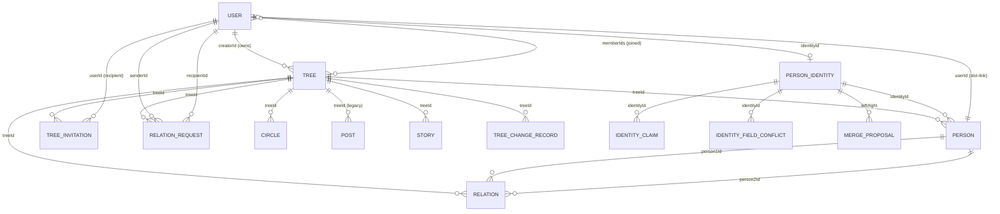
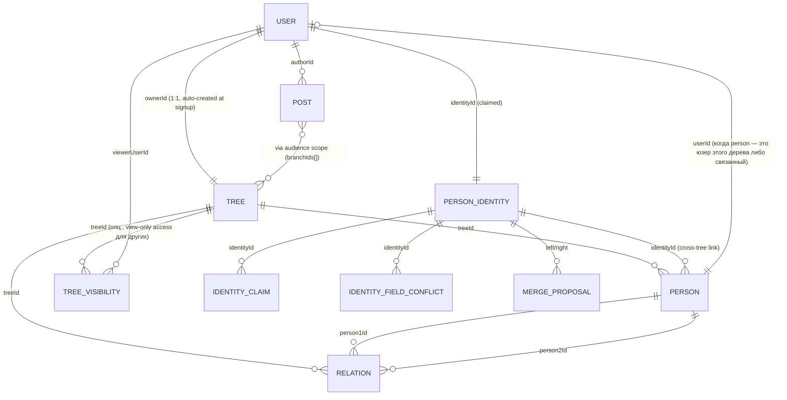
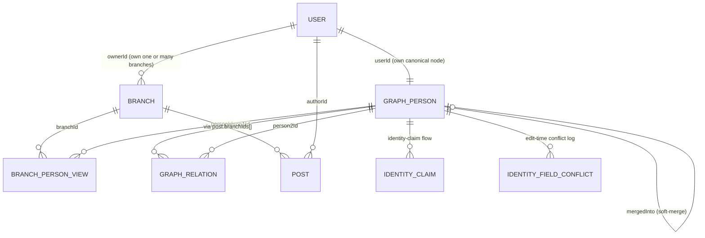

# Schema — текущая, целевая, диф

> **Контекст**: это часть Phase 0 audit. Источники — [PLAN.md](PLAN.md),
> [AUDIT.md](AUDIT.md), [tree_model_overhaul_rfc.md](../tree_model_overhaul_rfc.md),
> [backend/src/store.js EMPTY_DB](backend/src/store.js).
>
> Внутри JSONB-документа на postgres лежит весь state как набор массивов.
> «Таблицы» ниже — это массивы внутри JSONB. ER-диаграммы используют
> mermaid и описывают логические связи.

---

## 1. Текущая модель (как сейчас в коде)

### Что важно понимать про «текущую»

В коде сосуществуют **два слоя**:
- **Legacy**: `trees` + `persons` + `relations` + `personIdentities`. Это та модель, на которой работает 100% UI (включая [BranchSwitcherChip](lib/widgets/branch_switcher_chip.dart)) и большинство routes.
- **Graph mirror**: `graphPersons` + `graphRelations` + `branches` + `branchPersonViews`. Это уже частично выполненная Phase 3.1 из [tree_model_overhaul_rfc.md](../tree_model_overhaul_rfc.md). Заполняется из legacy через `_syncGraphFromLegacy` на каждом read/write. Используется только в `GET /v1/graph/relation` (Phase 4 BFS) пока что.

В диаграмме ниже — **только legacy**, потому что это то, что юзер видит и
почти все routes используют.

### ER-диаграмма (legacy)



### Поля основных сущностей (legacy)

| Сущность | Ключевые поля | Cardinality | Замечания |
|---|---|---|---|
| `users` | `id` (UUID), `identityId`, `email`, `profile {firstName, lastName, middleName, displayName, maidenName, photoUrl, gender, birthDate, ...}`, `createdAt`, `updatedAt` | один user ↔ один (опц.) personIdentity | identityId ставится автоматом при первом `_ensureUserIdentity`. |
| `trees` | `id`, `name`, `description`, **`creatorId`**, **`memberIds: [...]`**, **`members: [...]`** (legacy alias), `kind ('family'\|'friends')`, `isPrivate`, `publicSlug`, `isCertified`, `certificationNote`, `createdAt`, `updatedAt` | один user → много trees (creator); один tree ← много users (members) | `members` дубль `memberIds` — техдолг. Два юзера могут оба быть creator/member одного tree. |
| `persons` | `id`, **`treeId`**, **`userId`** (опц., если slot привязан), **`identityId`** (опц., но `_reconcilePersonIdentities` гарантирует что есть), `name`, `gender`, `birthDate`, `deathDate`, `birthPlace`, `deathPlace`, `photoUrl`, `primaryPhotoUrl`, `photoGallery: [...]`, `notes`, `familySummary`, `bio`, `visibility`, `lastPropagatedFields {field: lastValue}`, `creatorId` (creator-of-this-person), `createdAt`, `updatedAt`, `isAlive`, `maidenName`, `attributes: [...]` | один tree → много persons; один personIdentity → много persons (cross-tree); один user → 0..1 person per tree | Содержит **per-tree копию** канонических полей. Identity propagation мажет canonical поля; per-tree поля (`notes`, `familySummary`, `bio`, `visibility`) остаются tree-local. |
| `personIdentities` | `id`, `userId` (опц., если identity claimed), `claimedByUserId`, `personIds: [...]`, `primaryPersonId`, `mergedInto` (опц.), `isLiving`, `isPublicDiscoverable`, `stewardUserIds: [...]`, `createdAt`, `updatedAt` | каждый реальный человек = один identity; identity может линковать N persons (по одному на дерево) | После Phase 3.1 — `id` совпадает с `graphPerson.id`. |
| `relations` | `id`, **`treeId`**, `person1Id`, `person2Id`, `relation1to2 ('parent'\|'child'\|'spouse'\|'sibling'\|...)`, `relation2to1`, `customRelationLabel1to2`, `customRelationLabel2to1`, `isConfirmed`, `marriageDate`, `divorceDate`, `parentSetId`, `parentSetType`, `isPrimaryParentSet`, `unionId`, `unionType`, `unionStatus`, `createdBy`, `createdAt`, `updatedAt` | tree-scoped; одна и та же родительская пара в двух разных деревьях = два relation rows. | |
| `treeInvitations` | `id`, `treeId`, `userId` (recipient), `addedBy`, `relationToTree`, `status`, `createdAt` | tree-scoped, на 1 receiving user. Acceptance добавляет в `tree.memberIds`. | |
| `relationRequests` | `id`, `treeId`, `senderId`, `recipientId`, `senderToRecipient`, `targetPersonId`, `message`, `status`, `createdAt` | tree-scoped. Acceptance вызывает `linkPersonToUser` или `ensureUserPersonInTree`. | |
| `circles`, `circleMembers` | tree-scoped circle (audience preset). `kind ∈ {all_tree, favorites, descendants_of, ancestors_of, pair, custom}`. Members = identityIds. | tree-scoped | Auto-создаются по relations. Вне scope refactor. |
| `posts`, `stories`, `comments`, `chats`, `messages` | feed/chat. Используют `treeId` (а posts ещё `branchIds[]` для pre-existing graph layer). | tree-scoped | Audience через `branchIds[]` — частично уже на graph-модели. |
| `treeChangeRecords` | tree-scoped audit log. | tree-scoped | Используется для undo/redo. |
| `identityClaims` | `id`, `identityId`, `claimantUserId`, `evidence`, `status` | identity-scoped | Manual claim flow. |
| `identityFieldConflicts` | Phase 1.3 conflict surfacing. | identity-scoped | |
| `mergeProposals` | Two persons → merge candidate. | identity-scoped | |
| `dismissedIdentitySuggestions` | Per-user dismissal of 💡 suggestion. | user-scoped | |
| `personAttributes` | Per-person privacy/visibility attributes. | person-scoped | |
| `migrationStatus` | `{treesToGraph: 'complete' \| undefined, treesToGraphAt}` | singleton | |

### Текущая модель (graph mirror, существует параллельно)

Эти коллекции пишет [migrateTreesToGraphAndBranches](backend/src/migration-utils.js:395) на startup
+ инкрементальный sync через `_syncGraphFromLegacy`. Читает из них только
`/v1/graph/relation`. Существует, но **большая часть логики НЕ
использует** их.

| Сущность | Ключевые поля | Cardinality |
|---|---|---|
| `graphPersons` | **`id` = identityId**, `legacyPersonIds: [...]`, `userId` (опц.), `name`, `gender`, `birthDate`, `deathDate`, `birthPlace`, `deathPlace`, `photoUrl`, `primaryPhotoUrl`, `photoGallery`, `maidenName`, `isAlive`, `mergedInto`, `deletedAt`, `version`, `isPublic`, `source ('manual'\|'wikidata'\|'user-claim')`, `contactPrivacy ('owner-only')`, `createdBy`, `createdAt`, `updatedAt` | один на одного реального человека |
| `graphRelations` | `id` (= legacy relation id первого в dedup-группе), `person1Id` (= graphPerson.id = identityId), `person2Id`, `relation1to2`, `relation2to1`, `legacyRelationIds: [...]`, `legacyTreeIds: [...]`, остальные поля как у legacy | дедуплицировано; одна пара person1/person2/relation1to2 = одна row |
| `branches` | `id` (= legacyTreeId), `legacyTreeId`, **`ownerId`** (= legacy `tree.creatorId`), `name`, `description`, `isPrivate`, `kind`, `includeRules: {type: 'manual'\|'blood-from-me'\|..., manualPersonIds: [...]}`, **`memberIds: [...]`** (зеркалится из tree), `publicSlug`, `isCertified`, `certificationNote`, `deletedAt`, `createdAt`, `updatedAt` | один на legacy tree |
| `branchPersonViews` | `id`, `branchId`, `personId` (=graphPerson.id), `label` (per-branch override), `photoOverride`, `notes`, `familySummary`, `bio`, `visibility`, `legacyPersonId`, `createdAt`, `updatedAt` | per (branch, person) |

---

## 2. Целевая модель (по PLAN.md, без учёта pre-existing graph layer)

> ⚠️ В этой секции я описываю модель **строго по тексту PLAN.md**.
> Принципиальное отличие от того, что уже в коде, — **single tree per user**
> и центральная роль `personIdentities` как самостоятельной сущности
> (вместо `graphPersons`). См. [AUDIT.md](AUDIT.md) → «Open architecture
> questions» Q1 — это нужно зафиксировать с тобой ДО старта Phase 1.

### ER-диаграмма (целевая, PLAN.md trajectory)



### Изменения по сущностям

| Сущность | До | После | Phase |
|---|---|---|---|
| `users` | как есть | как есть | — |
| `trees` | мульти на юзера; `creatorId` + `memberIds[]` + `members[]` | **1:1 с user**; `ownerId` (← `creatorId`); `memberIds[]` удалён; `kind` остаётся | 1, 5 |
| `persons` | tree-scoped | tree-scoped (без изменений) | — |
| `personIdentities` | side-table для cross-tree linking | **первоклассная сущность** — каждый реальный человек = одна запись, на которую указывают N persons из N деревьев | 2 |
| `relations` | tree-scoped | tree-scoped (без изменений) | — |
| `treeInvitations` | invite by userId/email → join tree | depreвhtируется (tree без member-конкции) | 3, 5 |
| `relationRequests` | flow подтверждения родства; create person + link | переписывается на identity-claim | 3 |
| `treeVisibility` (NEW) | — | `{treeId, viewerUserId, scope ('view-only')}` — опционально, для шеринга своего дерева в read-only | 5 |

### Поведенческие изменения (повтор PLAN.md)

* **Регистрация**: `_ensureUserIdentity` + `createTree` происходят автоматом, юзер получает дефолтное «Дерево {firstName}» с self-person.
* **Add relative**: при вводе имени/даты — inline call в backend `findCrossTreeIdentitySuggestions` (расширенный scope из Phase 2). Если есть кандидаты — UI показывает «Возможно, это {Имя} из дерева {OwnerName}. Связать?». Confirm → создаёт `linkPersonsByIdentity`.
* **Invite**: семантика меняется с «привязать твой userId к слоту в моём дереве» на «связать identityId твоего self-person в твоём дереве с моим слотом». Receiver видит свой граф — никогда не «попадает» в чужое дерево как раньше.
* **View extended**: toggle «Моё / Расширенная сеть». Расширенная — обходит identity-граф shortest-path, рендерит чужие nodes стилем-«не-моё».
* **Conflict**: identity propagation идёт между разными person record'ами одного `personIdentities`, edit-time conflicts уже есть (Phase 1.3 в коде).

### Что удаляется

- `tree.creatorId` → `tree.ownerId` (rename).
- `tree.memberIds`, `tree.members` (полностью).
- `tree.member`-add via invite (`linkPersonToUser` slot-semantics).
- `BranchSwitcher` UI (если single-tree-per-user победит).

### Что добавляется

- Новый endpoint `POST /v1/invitations/identity-claim`.
- Новый endpoint `GET /v1/me/extended-family` — обход identity-графа.
- Новая сущность `treeVisibility` (опционально, Phase 5).
- `connectedTreesPhase` feature-flag в [BackendRuntimeConfig](backend/src/config.js).

---

## 3. Diff — что добавляется, удаляется, мигрируется

### 3.1 Колонки/поля

| Сущность | Действие | Поле | Старое значение | Новое значение | Phase |
|---|---|---|---|---|---|
| `trees` | RENAME | `creatorId` → `ownerId` | UUID юзера-создателя | UUID юзера-владельца (тот же семантический смысл) | 5 |
| `trees` | DROP | `memberIds: [...]` | UUIDы юзеров, которые могут редактировать дерево | (нет) | 5 |
| `trees` | DROP | `members: [...]` | legacy-дубль `memberIds` | (нет) | 5 |
| `trees` | KEEP | `name`, `description`, `kind`, `isPrivate`, `publicSlug`, `isCertified`, `certificationNote`, timestamps | без изменений | без изменений | — |
| `users` | KEEP | `identityId` | привязка к canonical identity | без изменений | — |
| `personIdentities` | UPGRADE | `userId`, `claimedByUserId`, `personIds[]`, `primaryPersonId`, `mergedInto`, `isLiving`, `isPublicDiscoverable`, `stewardUserIds[]` | side-table | первоклассная сущность; identityId — primary key для всего cross-tree | 2 |
| `personIdentities` | KEEP-ADD | `discoverableByExtendedFamily?: boolean` | (новое) | для Phase 4 расширенного scope | 2/4 |
| `treeInvitations` | DEPRECATE | вся коллекция | invite by userId/email | заменяется identity-claim invite | 3, 5 |
| `relationRequests` | REPURPOSE | `targetPersonId` semantics | привязать requester'а к слоту | создать identity-link с self-person'ом requester'а | 3 |
| `treeVisibility` (NEW) | ADD | `{treeId, viewerUserId, grantedBy, scope, createdAt}` | (нет) | view-only access для чужого дерева | 5 |
| `posts` | DROP `treeId` | в пользу `branchIds[]` | tree-scoped | branch-scoped (но в single-tree модели = single-element) | 5/6 |
| `migrationStatus` | KEEP | `treesToGraph: 'complete'` уже есть | + `connectedTreesPhase: 'phase1'\|...\|'complete'` | поэтапный трекер | 1-7 |

### 3.2 Migration-шаги (Phase 6)

Цель Phase 6 — все существующие юзеры приведены к **«одно дерево на юзера»**.

```
ВХОД (после старта Phase 6):
  Юзер A — owner деревьев T1, T2; member дерева T3 (где B — creator).
  Юзер B — owner T3; member T1.
  Юзер C — owner T4 (ничей не member).

ВЫХОД:
  Юзер A — owner единственного дерева T1' (выбранного как primary).
            T2 → опции: merge into T1' / spawn новое identity-link / архив.
            T3 → identity-link между A.self-person и слотом в T3 (но T3 теперь B's tree).
  Юзер B — owner единственного дерева T3'.
            B как member T1 → identity-link с persistent slot в T1.
  Юзер C — owner T4 (без изменений).
```

Алгоритм:

1. **Pre-flight check**: каждый user → `tree[]` через `creatorId` + `memberIds`. Помечаем primary candidate (обычно — где user — creatorId; fallback — где больше всего persons).
2. **Auto-pick primary** или **prompt user** (через onboarding wizard для тех, у кого N>1).
3. **Для каждого secondary tree T** (которое НЕ primary user'а):
   - Если у T есть persons, которых нет в primary через identity → предложить merge-по-identity (matcher).
   - После merge в primary: T удалить, persons переместить в primary с новыми local-relations.
4. **Для каждого tree, где user есть как member, но не creator**:
   - Найти person с `userId === user.id` в этом дереве. Если его identity = identity self-person'а в primary → ничего делать, это уже identity-link.
   - Если identity отличается → создать `linkPersonsByIdentity` слитие.
5. **После всех users**: для каждого `tree.memberIds`/`members` — drop. Только `ownerId`.
6. **Rename**: `tree.creatorId` → `tree.ownerId`. Migration-проход полностью read+write через JSONB патч.
7. **Audit verify**: количество persons до и после миграции — каждый persistent через identity. Failed migration = rollback (BACKUP_BEFORE_PHASE6 копия restore).

### 3.3 API breaking changes

| Endpoint | До | После | Phase |
|---|---|---|---|
| `POST /v1/trees` | создаёт новое дерево | (зависит от Q1) либо депрекейтится, либо «создать additional branch» | 1, 5 |
| `GET /v1/trees` | список trees юзера (1+) | always returns 1 tree | 5 |
| `GET /v1/trees/selectable` | селектор для multi-tree | (depreвhtируется — нет селектора) | 5 |
| `POST /v1/invitations/pending/process` | `linkPersonToUser` (slot-link) | (depreвhtируется — 3 месяца поддерживается) → новый `POST /v1/invitations/identity-claim` | 3 |
| `POST /v1/trees/:treeId/invitations` (create) | invite user by id/email → join tree | (deprecates, заменяется identity-claim) | 3, 5 |
| `POST /v1/tree-invitations/:id/respond` | accept → add to memberIds | (deprecates) | 3, 5 |
| `DELETE /v1/trees/:treeId/persons/:personId/user-link` | owner отвязывает userId от слота | остаётся как owner-side recovery; но `tree.memberIds` нет — просто person.userId = null | 3, 5 |
| `POST /v1/trees/:treeId/persons/:personId/link-identity` | confirm 💡 → linkPersonsByIdentity | без изменений (это уже identity-friendly endpoint) | — |
| `GET /v1/me/extended-family` (NEW) | — | обход identity-графа для расширенного вида | 4 |

### 3.4 Hive box migration (client)

[lib/models/family_tree.dart](lib/models/family_tree.dart) — Hive type 2.
После Phase 5 поля `creatorId` → `ownerId`, `memberIds`/`members` удалены.

Опции:
- **A**: bump Hive type id → новый adapter; старые boxes падают на open. Юзеры теряют offline кеш на 1 запуск, потом восстанавливается.
- **B**: написать adapter migration внутри `family_tree.g.dart` — read как старая, write как новая, или поддержать оба формата transitional.
- **C**: drop+recreate Hive box при первом запуске после Phase 5 — самый простой и наименее ошибкоопасный вариант.

Решить в DECISIONS.md перед Phase 5.

---

## 4. Альтернативная целевая модель — graph + branches (что уже в коде)

> Это альтернатива из [tree_model_overhaul_rfc.md](../tree_model_overhaul_rfc.md).
> Уже частично исполнена. Если выбираем её как «source of truth» вместо
> PLAN.md — модель ниже.

### ER-диаграмма (graph + branches)



Главное отличие: **`branches` — UI-сущность, граф — backend-сущность**. Юзер
видит ветки (Моя кровь / Семья девушки / Прабабушкина), но за кулисами
nodes общие.

`tree.creatorId` → `branch.ownerId` уже сделан в граф-зеркале.
`tree.memberIds` → `branch.memberIds` сейчас зеркалится но семантически
не нужен (если RFC доводится до конца).

В этой модели Q1 (single-tree vs multi-branch) решается так: **multi-branch
оставляем**, но «branch» — это срез global графа, а не контейнер своих
людей. Это совместимо с PLAN.md только если переинтерпретировать
«одно дерево на юзера» как «одна основная ветка `blood-from-me`».

---

## 5. Что зафиксировать перед Phase 1

Прежде чем начинать менять код, нужно ответить:

1. **PLAN.md vs RFC** (Q1 в [AUDIT.md](AUDIT.md)) — выбираем «single tree per user» или «graph + branches»?
2. **memberIds** — drop полностью или конвертировать в `treeVisibility`?
3. **Hive migration** — A/B/C из 3.4?
4. **Старые invite-link'и** — поддерживаем сколько после cutover?
5. **Phase 6 prompt-user vs auto-pick primary** — нужна UX-сессия для onboarding wizard'а на N>1 trees?

После ответа на 1-3 я могу:
- Если PLAN.md побеждает: написать конкретный rollout-script для Phase 1 (auto-create tree + миграция existing users без trees).
- Если RFC побеждает: переписать PLAN.md, чтобы он соответствовал реальному коду.
- Если гибрид: зафиксировать в DECISIONS.md компромиссную трактовку.

---

## Заметки

* Postgres-store (`backend/src/postgres-store.js`) — JSONB-документ, миграции через JSONB патч, не SQL DDL.
* SQLite/Hive (client) — нужен план миграции при изменении `FamilyTree.fromMap`/`.toMap`.
* Backup перед Phase 6: snapshot всего JSONB документа в отдельную row + media-ссылки.
* Production rollout: feature-flag по группам пользователей (PLAN.md уже это упоминает в Phase 1 и Phase 6).
