# UX Audit — Rodnya v1.0.2+10 — 2026-05-25

## Methodology
- Device: Samsung S20 FE, ADB serial `RF8N920E18F`
- APK: `com.ahjkuio.rodnya_family_app`, version `1.0.2+10`
- Reference: Telegram UX patterns as the quality bar for auth, chat, feed speed, safe destructive actions, navigation predictability, and compact information density
- Approach: systematic real-device walkthrough, `adb shell screencap -p` screenshots, `uiautomator dump` when hierarchy or touch targets needed confirmation
- Screenshots retained: 49 PNG files in `screenshots/`
- Constraints: read-only UX audit. No production account creation, no real social posting, no destructive data actions, no calls to real users.
- Coverage limits: full first-time onboarding wizard was not completed because registration would create production data. System notification shade and real call UX were not audited because the device had an active personal call surface during the session. Chat/call send flows were blocked by absence of a safe peer chat in the smoke account.

## Executive Summary
- Total screens/states audited: 49
- Critical issues: 4
- Major issues: 18
- Minor polish: 14
- Strategic UI observations: 8

Rodnya already has a recognizable visual language: dark textured background, mint actions, family-tree iconography, profile completion, feed privacy targeting, and a bottom navigation model. The app feels more like a designed product than a raw MVP.

The main UX risk is not visual polish; it is trust. A non-technical family user can accidentally sign out without confirmation, see the wrong validation error on registration, tap advertised social login that is not actually available, and open the central tree feature without understanding how to edit, connect, or safely undo actions. Compared with Telegram, Rodnya has heavier screens, more hidden gestures, weaker destructive-action safety, and more repeated create entry points.

The highest-priority fixes should focus on safe recovery, first-run clarity, tree discoverability, auth reliability, and bottom-nav/content overlap.

## Flow 1 — First-Time User

### Screen 1.1 — Auth Landing / Login
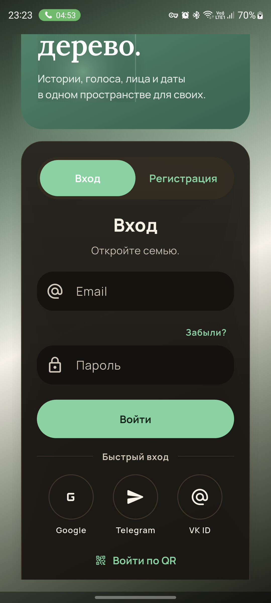

**Observations**: Auth opens into a branded landing block plus login card. On Samsung S20 FE with an active Android call/status pill, the hero is clipped at the top: the user sees only the tail of the headline (`дерево.`) before the card. Login controls are visually clear and large.

**Pain points**:
- 🟠 major: First impression is partially broken under real Android status conditions; the most important brand/value text can be clipped.
- 🟠 major: The login card is oversized. The user must visually process hero, segmented tabs, title, subtitle, fields, forgot password, submit, quick login, and QR in one long vertical stack.
- 🟡 minor: The `Вход / Регистрация` segmented control is clear visually, but its size competes with the screen title below it.

**Recommendations**: Move auth content into a safe-area aware layout. On small/medium Android phones, keep the full headline visible or remove the large hero after the first launch. Make the auth card start higher only when it does not clip the hero.

**Telegram comparison**: Telegram auth is compact and focused: one primary task per screen, minimal decorative content, and no clipped hero. Rodnya feels more premium visually, but slower to parse.

### Screen 1.2 — Empty Login Validation
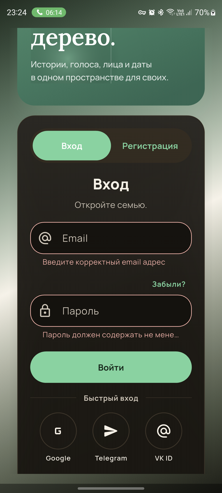

**Observations**: Empty submit produces inline errors. The password error truncates (`Пароль должен содержать не мене...`), while the field layout remains large.

**Pain points**:
- 🟠 major: Truncated error copy is not actionable. A parent user should not have to infer the validation rule.
- 🟡 minor: Inline errors use the right color, but the large rounded field shape makes the error feel detached from the input.

**Recommendations**: Let error text wrap to two lines under the field. Use specific copy: `Минимум 6 символов` or the actual rule. Keep field height stable when error appears.

**Telegram comparison**: Telegram error states are short, precise, and do not truncate. Rodnya is visually richer but less exact.

### Screen 1.3 — Registration Form
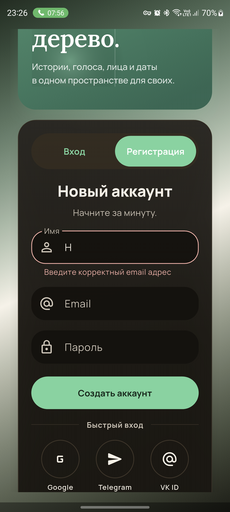

**Observations**: Registration shows name, email, password, quick login, and consent. After entering a character in `Имя`, the app shows `Введите корректный email адрес` under the name field.

**Pain points**:
- 🔴 critical: Validation error is attached to the wrong field. This breaks trust immediately: the user typed a name and sees an email error.
- 🟠 major: Keyboard and long card layout make the form fragile; important lower fields and consent can be pushed out of view.
- 🟡 minor: `Начните за минуту.` is friendly but vague; the form asks for multiple things and provider login below.

**Recommendations**: Fix validation-field mapping before any growth work. Each field should have its own label, error, and rule. For mobile, split registration into short steps or reduce vertical hero/card height so the keyboard does not hide the path forward.

**Telegram comparison**: Telegram registration/auth asks for one thing at a time. Rodnya’s all-in-one form increases cognitive load and makes field errors more costly.

### Screen 1.4 — Registration Lower Form / Consent
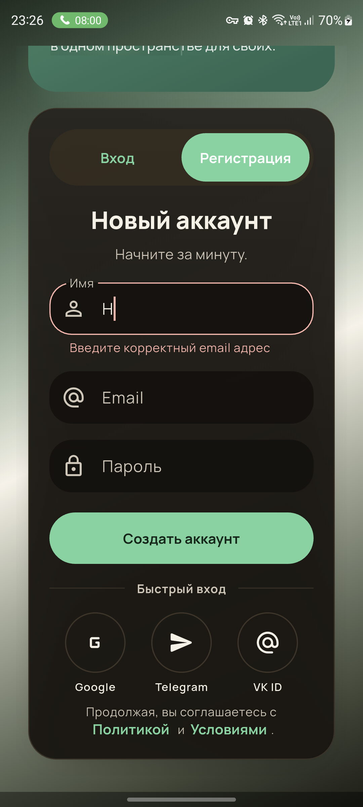

**Observations**: Lower area contains password, create account CTA, quick login, and consent links. Consent is visible, but the screen is visually dense.

**Pain points**:
- 🟠 major: Consent and quick login compete with the primary registration flow; this weakens the sense of a single next action.
- 🟡 minor: Social login icons are large, but disabled/unavailable state is not communicated until after tap.

**Recommendations**: Keep primary registration path dominant. Show unavailable providers as disabled with short helper copy, or hide providers not configured in production.

**Telegram comparison**: Telegram does not present unavailable auth options. Rodnya advertises choices that can fail.

### Screen 1.5 — Google Login Attempt
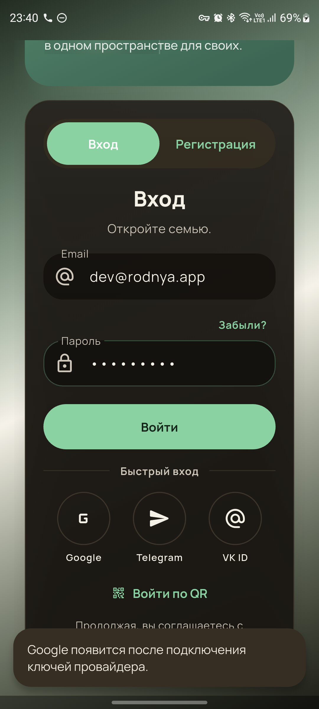

**Observations**: Tapping Google shows a snackbar: `Google появится после подключения ключей провайдера.` No Google confirmation dialog appeared.

**Pain points**:
- 🔴 critical: Google login is visible as a primary quick-login option, but it is not actually usable in this production APK/environment.
- 🔴 critical: Q2 expected confirmation UX was not observable: no photo/name/email confirmation dialog.
- 🟠 major: Snackbar explains an implementation/config state, not what the user should do next.

**Recommendations**: Hide Google until provider keys are configured, or show a disabled state with `Скоро будет доступно`. If enabled, Telegram-level confirmation should show avatar, name, email, and explicit `Продолжить как ...`.

**Telegram comparison**: Telegram does not expose an auth method that is knowingly unavailable. Rodnya’s current state feels like a staging feature leaking into production.

### Screen 1.6 — First-Run Wizard / Setup Banner

**Observations**: Full first-time wizard was not completed because creating a production account was out of scope. After login with the reusable smoke account, no `Закончите настройку` banner was observed on the home/feed screen.

**Pain points**:
- 🟠 major: Wizard skip recovery could not be verified from the observed logged-in state.
- 🟠 major: If a skipped/incomplete user lands on the current empty feed without a setup banner, recovery is weak.

**Recommendations**: Make incomplete setup recoverable from home with a persistent, dismissible banner: `Закончите настройку семьи`, progress `1/4`, and CTA `Продолжить`. Tapping should resume the exact next wizard step, not restart.

**Telegram comparison**: Telegram keeps incomplete account/profile setup discoverable through stable surfaces such as profile, settings, and chat list hints.

## Flow 2 — Returning User

### Screen 2.1 — Populated Home / Feed

**Observations**: Returning user lands on a rich feed: header, tree selector, search, activity, QR/tree action, event chips, create affordance, branch filters, composer teaser, posts, and bottom nav.

**Pain points**:
- 🟠 major: First viewport is very busy. `Создать`, composer teaser, media icons, event chips, and nav all compete.
- 🟠 major: The bottom nav is tall and visually heavy; it occupies a lot of reading space and can overlap lower content in other screens.
- 🟡 minor: Event chips are attractive but may not be the highest-value element for a returning user compared with recent family activity.

**Recommendations**: Prioritize feed reading and one creation path. Consider a compact top bar after first session. Keep event chips horizontally scrollable but less dominant than family updates.

**Telegram comparison**: Telegram’s chat list prioritizes recent activity and minimizes decoration. Rodnya has stronger brand expression, but lower information efficiency.

### Screen 2.2 — Empty Home / Feed
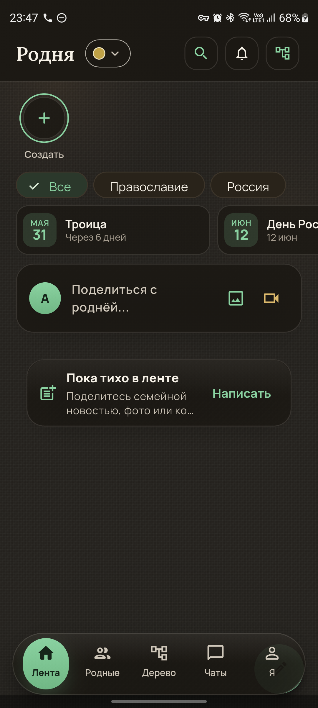

**Observations**: Empty feed shows events, a composer teaser, and a card: `Пока тихо в ленте`, CTA `Написать`.

**Pain points**:
- 🟠 major: Empty state does not guide the user to the highest-impact first action: add relatives, create tree, invite family, or post.
- 🟠 major: There are multiple create affordances (`Создать`, composer teaser, `Написать`) without a clear hierarchy.
- 🟡 minor: Copy is natural, but the truncated body text (`ко...`) reduces polish.

**Recommendations**: For new/empty accounts, make the first task explicit: `Добавьте первого родственника` or `Пригласите семью`. Keep `Написать` secondary until there is an audience.

**Telegram comparison**: Telegram empty states are usually task-specific: start chat, invite contacts, search. Rodnya’s empty feed is pleasant but less directional.

### Screen 2.3 — Navigation Model

**Observations**: Bottom nav has five destinations: `Лента`, `Родные`, `Дерево`, `Чаты`, `Я`. Icons are recognizable, but the nav is styled as a large floating pill.

**Pain points**:
- 🟠 major: The nav consumes too much vertical space and overlaps content in profile/edit screens.
- 🟡 minor: `Я` is understandable in Russian apps, but `Профиль` may be clearer for older users.

**Recommendations**: Reduce bottom nav height, reserve bottom inset correctly, and test every scrollable screen with bottom content visible above nav.

**Telegram comparison**: Telegram uses minimal tab/navigation surfaces and maximizes content area. Rodnya’s nav feels more decorative than utilitarian.

## Flow 3 — Feed

### Screen 3.1 — Create Post
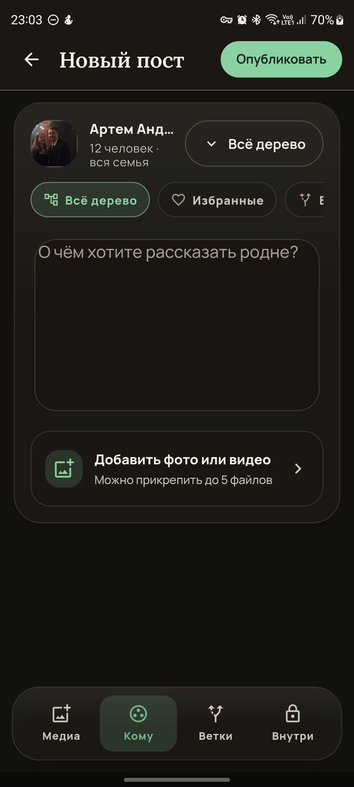

**Observations**: Composer has a strong structure: publish CTA, author identity, audience selector, branch chips, text area, media attachment, and bottom tabs.

**Pain points**:
- 🟠 major: `Публиковать` is enabled-looking even when content is empty; if disabled, state is not visually obvious enough.
- 🟠 major: Bottom mode labels (`Медиа`, `Кому`, `Ветки`, `Внутри`) are short but not all self-explanatory for a parent user.
- 🟡 minor: Author name truncates early (`Артем Анд...`) despite ample horizontal context.

**Recommendations**: Disable publish clearly until text/media exists. Rename ambiguous tabs or add one-line contextual helper inside the selected tab, not as generic onboarding text.

**Telegram comparison**: Telegram compose is fast and minimal. Rodnya adds useful family privacy controls but at the cost of speed.

### Screen 3.2 — Audience Selector
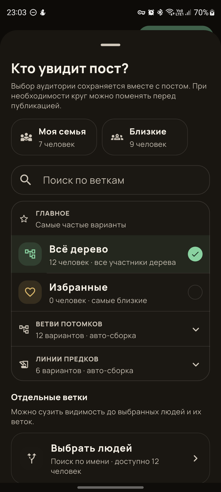

**Observations**: Bottom sheet asks `Кто увидит пост?`, explains that the audience is saved with the post, and offers family/close groups, search, and branch filters.

**Pain points**:
- 🟡 minor: This is one of the stronger UX areas, but the sheet is long and may be intimidating for a simple family post.
- 🟡 minor: `Отдельные ветки` is accurate but may need plainer wording for non-technical users.

**Recommendations**: Keep this pattern, but add a simple default path: `Вся семья` selected, `Изменить` if needed. Use plain labels: `Только выбранные ветки` instead of abstract branch taxonomy where possible.

**Telegram comparison**: Similar to Telegram channel/group audience clarity, but Rodnya has a more complex family-tree permission model. The extra complexity is justified only if the default is obvious.

### Screen 3.3 — Media Picker
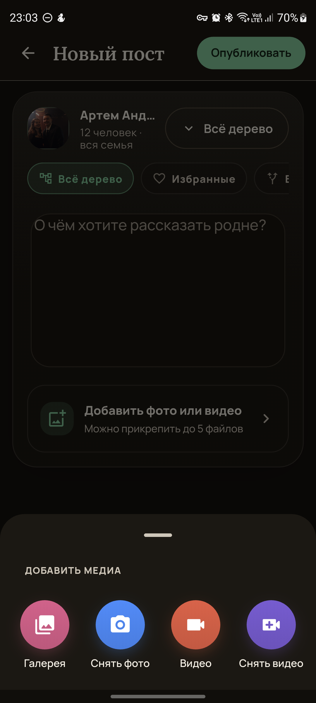

**Observations**: Media picker offers gallery/photo/video/camera choices. Icons are clear.

**Pain points**:
- 🟡 minor: The sheet is straightforward, but there is no visible permission pre-explanation before camera/gallery actions.

**Recommendations**: If Android permission is needed, show a small pre-permission rationale only at first use: `Нужно выбрать фото для семейного поста`.

**Telegram comparison**: Telegram media entry is faster because gallery thumbnails appear immediately. Rodnya’s action sheet is acceptable for MVP, slower than Telegram.

### Screen 3.4 — Post Detail / Media Viewer

**Observations**: Media opens full-screen with close/share and bottom engagement actions.

**Pain points**:
- 🟡 minor: Full-screen viewer is readable, but bottom actions have low contrast against the media area and feel more like labels than active controls.
- 🟡 minor: There is no obvious swipe/count affordance if a post has multiple media items.

**Recommendations**: Strengthen active affordance for like/comment/share. Add media count/dots when multiple attachments exist.

**Telegram comparison**: Telegram media viewer is very fast and strongly gesture-driven. Rodnya is close in layout, but less polished in action affordances.

### Screen 3.5 — Post Overflow
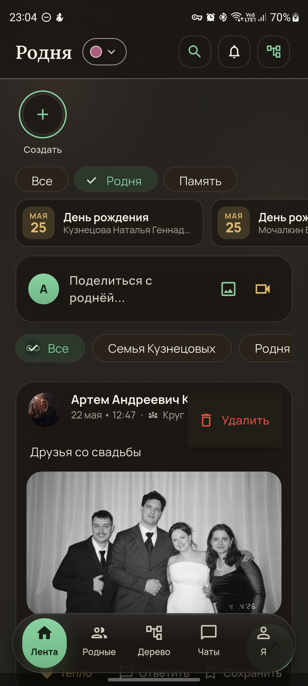

**Observations**: Overflow menu exposes a destructive `Удалить` action.

**Pain points**:
- 🟠 major: Only destructive action is visible; no edit, visibility, copy link, or report/context action.
- 🟠 major: Safe confirmation/undo was not verified because the audit avoided destructive production mutations.

**Recommendations**: Destructive post actions need confirmation and ideally undo: `Удалить пост? Он исчезнет у всех родственников.` Buttons: `Отмена`, `Удалить`. After delete, snackbar `Пост удалён` + `Вернуть`.

**Telegram comparison**: Telegram destructive actions are confirmed and often recoverable for short windows. Rodnya must match that safety bar for family content.

## Flow 4 — Tree

### Screen 4.1 — Tree View
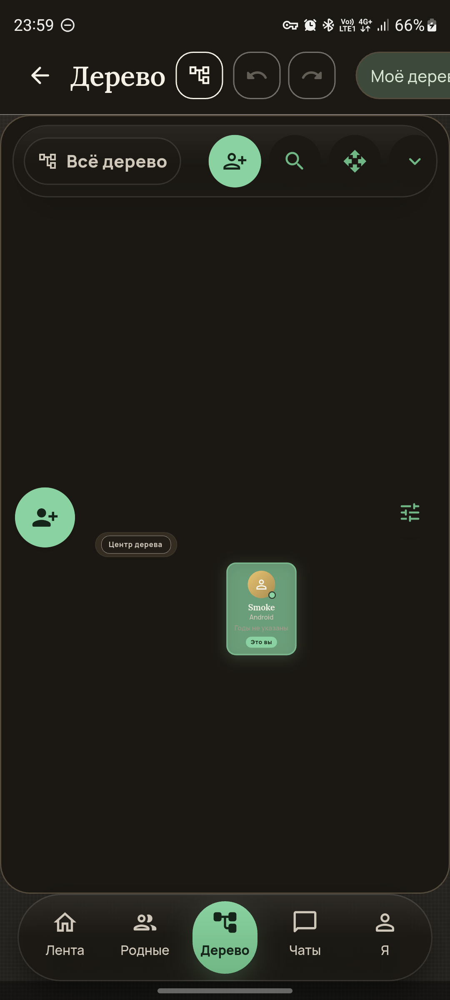

**Observations**: Tree opens as a large canvas with one centered person card, top toolbar, side add/settings buttons, and bottom nav. The visual metaphor is strong, but the screen is mostly empty.

**Pain points**:
- 🔴 critical: This is the central feature, but the primary next action is not obvious. A parent user sees an empty dark canvas and a small card without clear instruction.
- 🟠 major: Main person card is tiny relative to the canvas and hard to treat as interactive.
- 🟠 major: Toolbar icons are dense and partly ambiguous without labels.

**Recommendations**: For 0-1 person trees, show a guided empty canvas: `Добавьте маму, папу, детей или партнёра`, with relation-based buttons near the current person. Keep advanced canvas tools secondary.

**Telegram comparison**: Telegram’s core surface always starts with recognizable rows and obvious tap targets. Rodnya’s tree is novel, so it needs more explicit scaffolding than Telegram.

### Screen 4.2 — Add Person Dialog
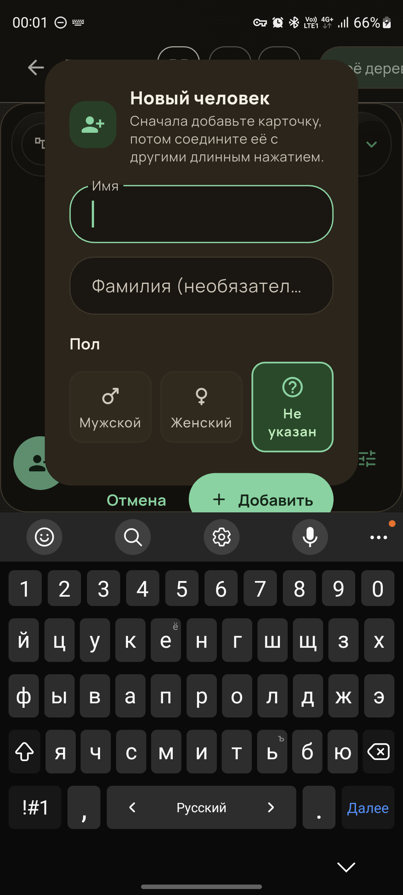

**Observations**: Dialog says: `Сначала добавьте карточку, потом соедините её с другими длинным нажатием.` It asks for name, optional surname, and gender. Keyboard covers lower actions.

**Pain points**:
- 🟠 major: The recommended relationship action is a hidden gesture: long press. This is poor discoverability for the target scenario.
- 🟠 major: Keyboard covers the bottom area and makes `Добавить` feel cramped.
- 🟡 minor: `Не указан` default is visually very prominent; it can look like a required choice rather than neutral state.

**Recommendations**: Replace “add loose card, then long-press connect” with relation-first creation: `Кем приходится?` → `Мама`, `Папа`, `Ребёнок`, `Партнёр`, `Другое`. Keep long-press as an advanced shortcut only.

**Telegram comparison**: Telegram avoids hidden gestures for required actions. Long press is usually optional/contextual, not the only way to complete a core task.

### Screen 4.3 — Person Tap Result

**Observations**: Tapping the central person card did not open visible details/edit controls during the audit. UI hierarchy stayed the same.

**Pain points**:
- 🔴 critical: Details/edit/delete path for a person is not discoverable from the main card.
- 🟠 major: If the card has a tap target, feedback is insufficient. If it does not, the expected action model is unclear.

**Recommendations**: Single tap on a person should open a bottom sheet with profile summary and actions: `Открыть профиль`, `Редактировать`, `Добавить родственника`, `Связать`, `Удалить`. Delete must require confirmation.

**Telegram comparison**: Tapping any Telegram chat/contact row opens the expected detail or conversation instantly. Rodnya’s central card should be equally predictable.

### Screen 4.4 — View / Zoom Controls
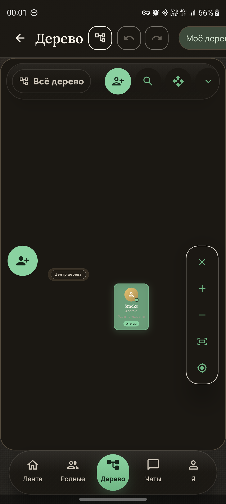

**Observations**: A vertical zoom/control rail appears with close, plus, minus, fit, and center controls.

**Pain points**:
- 🟠 major: Pinch-zoom feedback is not self-explanatory; icon-only controls help but do not teach gestures.
- 🟡 minor: Rail floats over the canvas and is visually detached from the toolbar state.

**Recommendations**: Add transient feedback during pinch: `80%`, `Вписано`, `Центрировано`. Keep zoom controls accessible but smaller after the user learns the gesture.

**Telegram comparison**: Telegram media maps gestures to immediate visual feedback. Rodnya needs similar response for tree zoom/pan.

### Screen 4.5 — Tree Selector / List
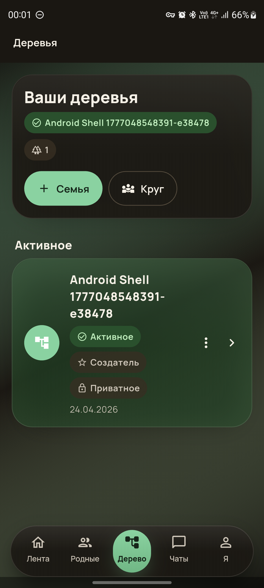

**Observations**: Tree list shows active tree, privacy/creator state, creation date, and family/circle creation buttons.

**Pain points**:
- 🟠 major: Tree names can be long and wrap heavily, reducing scan speed.
- 🟡 minor: `Семья` and `Круг` distinction is not explained at decision time.

**Recommendations**: Use a compact tree row with title, members, privacy, date, and an explicit overflow. Add a short difference label: `Семья — родственники`, `Круг — близкие без родства`.

**Telegram comparison**: Telegram folder/chat selectors are compact and list-first. Rodnya’s cards are attractive but lower-density.

### Screen 4.6 — Edit/Delete/PiP Coverage

**Observations**: Person edit/delete and PiP swap/drag behavior were not discoverable from the available tree state. No destructive delete action was invoked.

**Pain points**:
- 🟠 major: If edit/delete requires hidden gestures or deeper menus, the tree will confuse non-technical users.
- 🟠 major: Destructive tree actions need extra safety because family data feels permanent and emotionally important.

**Recommendations**: Every person detail sheet should expose edit/delete visibly. Delete copy should explain consequence: `Удалить карточку из дерева? Связи с родственниками будут удалены.` Offer `Отмена`, `Удалить`, and an undo snackbar where possible.

**Telegram comparison**: Telegram deletion is guarded and phrased around consequence. Rodnya should be even more careful because it handles family structure.

## Flow 5 — Chats

### Screen 5.1 — Chats List Empty State
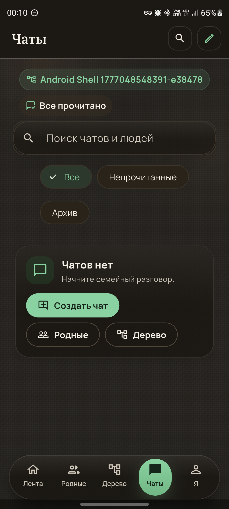

**Observations**: Chat list has search, new chat, self/tree context chip, read-state chip, filters, and empty state with CTAs.

**Pain points**:
- 🟠 major: Empty state says `Начните семейный разговор`, but the account has no relatives, so the primary action should guide adding/selecting relatives first.
- 🟡 minor: Header and action buttons are clear, but the user sees many controls before there is any chat content.

**Recommendations**: For no relatives, change primary CTA to `Добавить родственника` or `Пригласить`. Only show `Создать чат` as primary when at least one eligible recipient exists.

**Telegram comparison**: Telegram empty chat list/search states point directly to contacts or new message. Rodnya’s empty state is close but should account for family graph prerequisites.

### Screen 5.2 — New Chat Picker
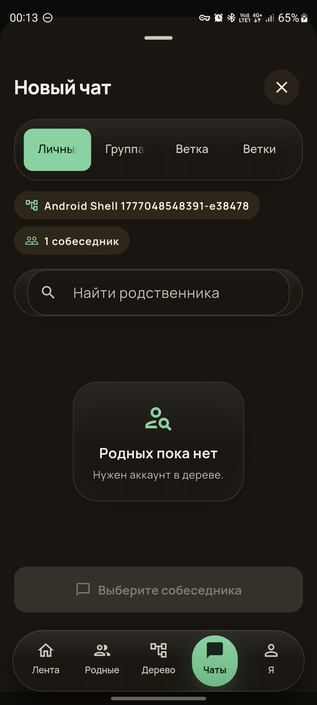

**Observations**: New chat opens as a bottom sheet with tabs `Личные`, `Группа`, `Ветка`, `Ветки`, search, empty relative state, and disabled `Выберите собеседника`.

**Pain points**:
- 🟠 major: The sheet says `Родных пока нет. Нужен аккаунт в дереве.` but the current account already has a tree/self card; the phrasing is confusing.
- 🟠 major: Disabled CTA is correct, but the recovery action is absent. User cannot fix the problem from this sheet.
- 🟡 minor: `Ветка` and `Ветки` adjacent tabs are hard to distinguish.

**Recommendations**: Add an inline recovery action: `Добавить родственника` or `Открыть дерево`. Rename tabs to clearer concepts: `1:1`, `Группа`, `Одна ветка`, `Несколько веток`, or use explanatory subtitles.

**Telegram comparison**: Telegram new chat picker always shows contacts or a clear invite path. Rodnya blocks the user but does not provide the fix in-place.

### Screen 5.3 — Chat Conversation / Messages

**Observations**: Opening an actual conversation, sending message, voice message, read receipts, and typing indicator were not audited because the smoke account had no safe peer chat.

**Pain points**:
- 🟠 major: No peer path from empty state means chat value is inaccessible in a fresh/smoke account.

**Recommendations**: Add a safe self/demo state or guided first chat after inviting/adding a relative. For production, do not create fake chats, but do make the prerequisite path obvious.

**Telegram comparison**: Telegram’s chat UX strength starts with immediate ability to find a recipient. Rodnya needs to remove the “dead end” before message-level UX can matter.

## Flow 6 — Calls

### Screen 6.1 — Calls Coverage

**Observations**: Call flow was not executed. The smoke account had no peer chat, and the device had an active personal call surface during the audit. No real-user calls were made.

**Pain points**:
- 🟠 major: Calls cannot be discovered from the empty chat state. If calls are phase 2, this is acceptable, but the requested flow could not be validated in production safely.
- 🟠 major: Bug A requirement (`lock → unlock → call still active + bilateral audio`) remains UX-unverified in this audit.

**Recommendations**: Provide a dedicated safe QA path for calls: two test accounts, one peer device/session, and a checklist covering outgoing ringing, in-call controls, lock/unlock, return to chat, missed call notification, and permissions.

**Telegram comparison**: Telegram call entry is visible in a chat header and the in-call state is resilient through lock/unlock. Rodnya should not expose calls broadly until this exact path is tested on real devices.

## Flow 7 — Profile / Settings

### Screen 7.1 — Profile Overview
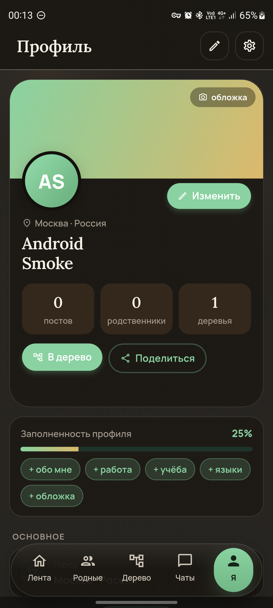

**Observations**: Profile has a strong identity card, cover, avatar, stats, `В дерево`, share, completion progress, and quick completion chips.

**Pain points**:
- 🟠 major: Bottom nav overlaps lower profile content (`ОСНОВНОЕ` / city area), making the screen feel unfinished.
- 🟠 major: `В дерево` and profile completion compete with each other as next action.
- 🟡 minor: Completion chips are useful, but many `+` chips create a task-list feeling instead of a calm personal profile.

**Recommendations**: Fix bottom inset first. Make profile completion a collapsible checklist or one primary `Продолжить заполнение` CTA with chips below.

**Telegram comparison**: Telegram profile screens are dense but stable; actions do not overlap content. Rodnya has richer profile goals, but needs stronger layout discipline.

### Screen 7.2 — Profile Edit Form
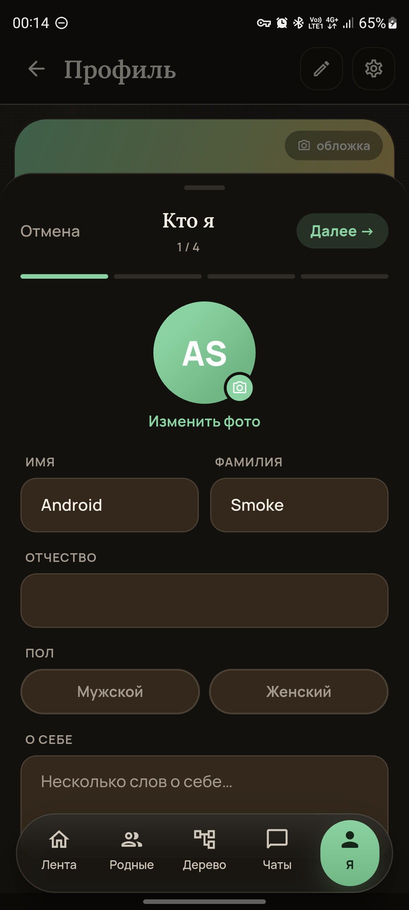

**Observations**: Edit form opens as a 4-step bottom sheet: `Кто я`, progress bar, avatar change, name fields, gender, about text.

**Pain points**:
- 🟠 major: Bottom nav remains visible behind/under the edit sheet and overlaps the lower form area.
- 🟠 major: Stepper is promising, but it is unclear whether unsaved edits are preserved if the user cancels or swipes down.
- 🟡 minor: Gender options look disabled because selected/unselected contrast is low.

**Recommendations**: Use a full-screen edit flow or a modal sheet that fully owns the bottom inset. Add unsaved-changes confirmation when leaving after edits. Make selected controls unmistakable.

**Telegram comparison**: Telegram edit profile is compact and does not compete with bottom navigation. Rodnya’s multi-step profile can work, but it must feel safe.

### Screen 7.3 — Profile Overflow / Sign Out
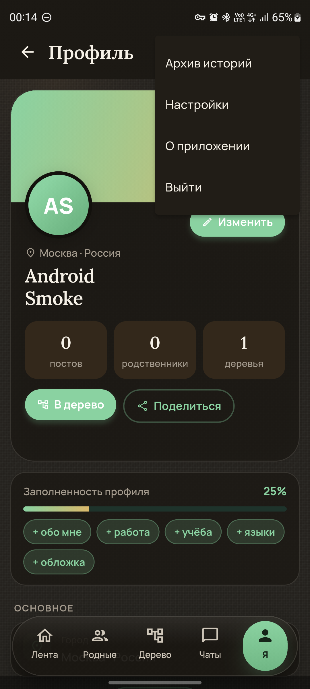

**Observations**: Overflow menu shows `Архив историй`, `Настройки`, `О приложении`, `Выйти`.

**Pain points**:
- 🔴 critical: In the earlier populated profile session, tapping `Выйти` immediately logged out without confirmation. This caused session loss during the audit.
- 🟠 major: `Выйти` sits in the same small menu as harmless informational actions.
- 🟠 major: There is no visible account identity in the sign-out action.

**Recommendations**: Sign out must show confirmation: `Выйти из аккаунта Артём ...? На этом телефоне нужно будет войти снова.` Buttons: `Отмена`, `Выйти`. Consider moving sign out to settings/account management only, not profile overflow.

**Telegram comparison**: Telegram puts account-level destructive/session actions behind settings and confirmation. Rodnya currently makes this too easy to trigger.

### Screen 7.4 — After Immediate Sign Out
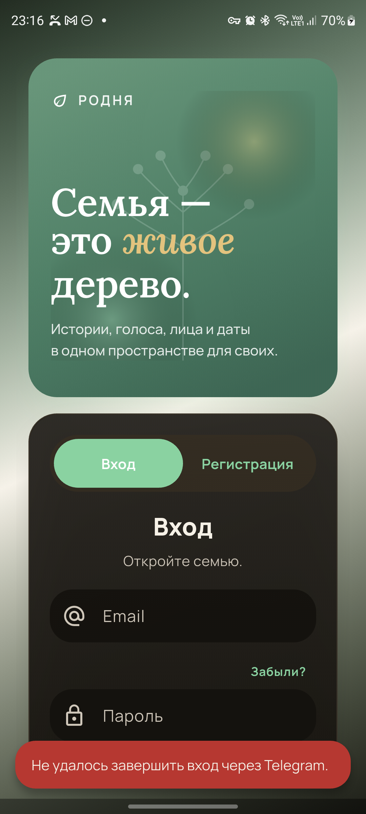

**Observations**: After accidental sign-out, the app returned to auth. A Telegram login snackbar error was visible from an earlier/adjacent attempt.

**Pain points**:
- 🔴 critical: No recovery path or “undo sign out” exists after accidental logout.
- 🟠 major: The snackbar about Telegram login can appear on the auth screen and distract from the fact that the user was just signed out.

**Recommendations**: Add sign-out confirmation first. If sign-out already happened, show a neutral confirmation snackbar: `Вы вышли из аккаунта` with no unrelated provider error.

**Telegram comparison**: Telegram treats account/session changes as high-impact settings actions. Rodnya should follow the same safety model.

### Screen 7.5 — Settings
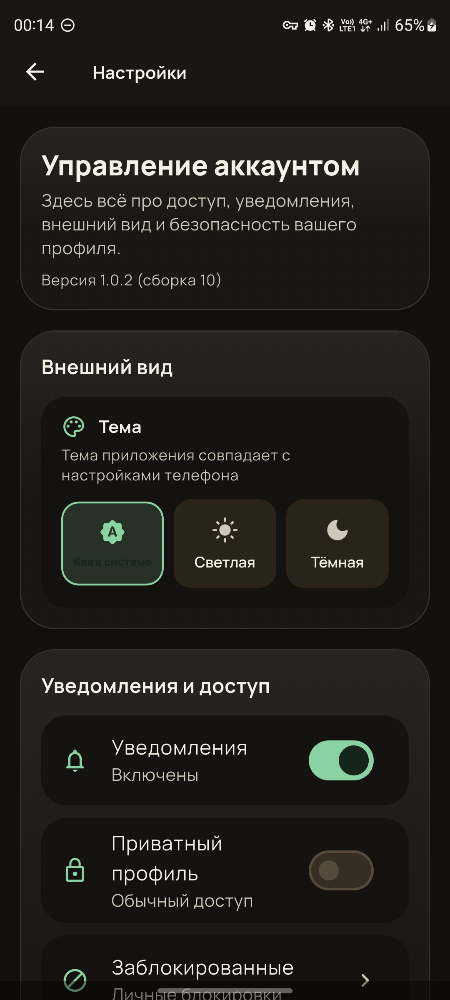

**Observations**: Settings include version, theme, notifications toggle, private profile, blocked users. Layout is visually consistent.

**Pain points**:
- 🟡 minor: `Как в системе` selected text has poor contrast and looks disabled.
- 🟡 minor: Settings are card-heavy; information density is lower than Telegram settings.
- 🟡 minor: `Уведомления` toggle says enabled, but system permission state is not visible here.

**Recommendations**: Improve contrast for selected theme. Show notification permission status if Android notifications are blocked. Reduce vertical card padding for operational settings.

**Telegram comparison**: Telegram settings are list-dense and fast to scan. Rodnya settings are friendlier but slower.

## Flow 8 — Notifications

### Screen 8.1 — In-App Activity
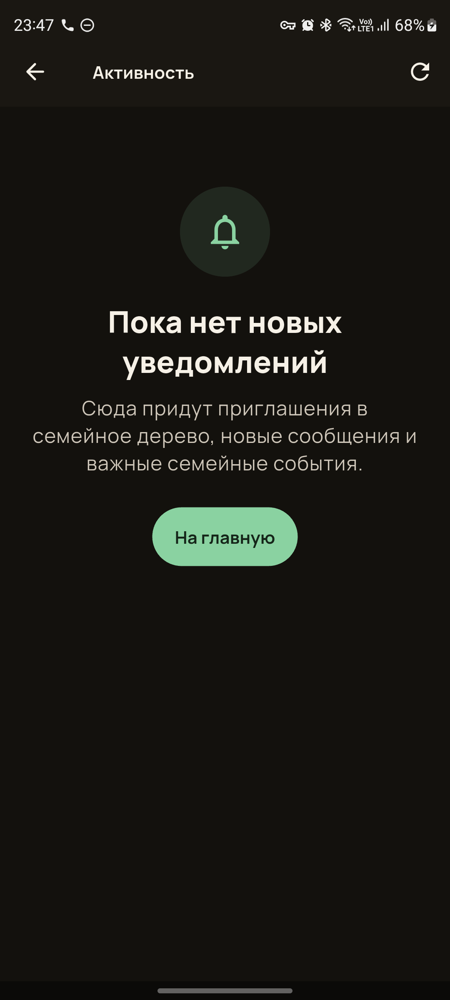

**Observations**: Activity screen has a clear empty state: `Пока нет новых уведомлений`, explanation of invitations, messages, family events, and CTA `На главную`.

**Pain points**:
- 🟡 minor: Empty state is clear, but `На главную` is a generic escape. A setup-related account might benefit more from `Добавить родственника` or `Пригласить`.
- 🟡 minor: Refresh icon exists, but empty state does not say whether refresh happened or when.

**Recommendations**: Keep this empty state, but adapt CTA to user state. Show lightweight refresh feedback: `Обновлено только что`.

**Telegram comparison**: Telegram uses badge/read states and pull-to-refresh patterns implicitly. Rodnya’s explicit empty state is good for family app onboarding.

### Screen 8.2 — Notification Permissions / Deep Links

**Observations**: Android notification permission request and system notification deep link were not audited because the device had an active personal call/notification surface. In app settings, notifications were shown as enabled.

**Pain points**:
- 🟠 major: Permission request UX remains unverified on this device/build.
- 🟠 major: Deep link behavior from notification tap remains unverified.

**Recommendations**: Run a separate notification QA pass with a clean device state: deny permission, allow permission, trigger family invite/message/event notifications, tap each, verify destination and back behavior.

**Telegram comparison**: Telegram notifications reliably deep-link into chat/event context. Rodnya should treat notification tap accuracy as a core retention feature.

## Strategic UI Observations

1. 🟠 Navigation is visually consistent but too heavy. The bottom nav frequently consumes or overlaps content. This is a systemic layout issue, not a single-screen polish item.
2. 🟠 Rodnya uses many large rounded cards. The style is coherent, but card-inside-card compositions reduce information density and make simple actions feel slow.
3. 🔴 Destructive/session safety is below Telegram-level. Sign out needs confirmation immediately. Delete actions for posts/tree people need consequence copy and undo where technically possible.
4. 🟠 The tree feature needs relation-first UX. Canvas tools and long-press gestures should not be the first mental model for a family user.
5. 🟠 Empty states are visually good but not always state-aware. When there are no relatives, chat/feed CTAs should guide toward relatives/tree/invites, not posting or chat creation first.
6. 🟠 Auth providers must reflect production reality. Unconfigured Google/Telegram/VK should not be presented as normal working options.
7. 🟡 Russian copy is mostly natural. The biggest copy problems are not tone, but specificity: truncated errors, wrong field errors, and implementation-facing provider messages.
8. 🟡 Touch targets are generally large enough. The problem is not small taps; it is too many similarly weighted large actions.

## Telegram-Comparable Score

- Visual polish: 7/10
- Interaction speed: 5/10
- Information density: 5/10
- Discoverability: 4/10
- Safety/recovery: 3/10
- Overall: 5/10

Rodnya’s visual identity is stronger than many MVPs, but Telegram wins clearly on speed, predictability, compactness, and safe action handling. Rodnya should not copy Telegram visually; it should copy Telegram’s discipline: one obvious next action, no unavailable controls, fast feedback, and confirmations for risky actions.

## Prioritized Recommendations (Top 20)

1. 🔴 [critical] Add confirmation before sign out from every entry point → modal with account identity and `Отмена / Выйти` (estimated effort: small)
2. 🔴 [critical] Fix registration validation mapping → `Имя` must never show email errors (estimated effort: small)
3. 🔴 [critical] Hide or disable unavailable social login providers → no Google button until provider is configured; then show confirmation dialog with avatar/name/email (estimated effort: small/medium)
4. 🔴 [critical] Make tree person tap open a detail/action sheet → profile, edit, add relative, connect, delete (estimated effort: medium)
5. 🟠 [major] Replace long-press connection as primary tree instruction → relation-first add flow (`мама`, `папа`, `ребёнок`, `партнёр`) (estimated effort: large)
6. 🟠 [major] Fix bottom navigation insets globally → no overlap with profile/edit/settings/feed content (estimated effort: medium)
7. 🟠 [major] Add safe delete confirmations for posts and tree people → consequence copy plus undo where feasible (estimated effort: medium)
8. 🟠 [major] Redesign first-run empty home for setup → primary CTA should be `Добавить родственника` or `Продолжить настройку` (estimated effort: medium)
9. 🟠 [major] Make skipped wizard recovery persistent → home banner with progress and resume route (estimated effort: medium)
10. 🟠 [major] Make auth layout safe-area responsive → no clipped hero on S20 FE with call/status indicators (estimated effort: medium)
11. 🟠 [major] Improve chat empty state prerequisites → if no relatives, CTA should open tree/relatives, not dead-end chat creation (estimated effort: small)
12. 🟠 [major] Add recovery action inside new chat picker → `Добавить родственника` / `Открыть дерево` (estimated effort: small)
13. 🟠 [major] Clarify `Ветка` vs `Ветки` chat tabs → rename or add subtitles (estimated effort: small)
14. 🟠 [major] Add publish disabled state in composer → clear inactive CTA until content exists (estimated effort: small)
15. 🟠 [major] Make profile edit modal own the bottom inset → no nav overlap, unsaved changes confirmation (estimated effort: medium)
16. 🟠 [major] Add tree zoom/pinch feedback → percent/fit/center transient labels (estimated effort: medium)
17. 🟡 [minor] Let auth errors wrap instead of truncating → concise, actionable Russian text (estimated effort: small)
18. 🟡 [minor] Improve settings selected-state contrast → `Как в системе` should not look disabled (estimated effort: small)
19. 🟡 [minor] Reduce repeated create entry points on feed → one dominant creation path per state (estimated effort: medium)
20. 🔵 [polish] Make long names degrade gracefully in tree/profile/chat chips → max lines, ellipsis, accessible full name on details (estimated effort: small)

## Required Follow-Up QA Passes

- Full first-time onboarding with a disposable production-safe test account.
- Google login after provider configuration, including Q2 confirmation dialog.
- Two-device call QA with peer test account: outgoing, incoming, lock/unlock, audio both directions, missed call notification.
- Notification permission/deep-link QA with clean notification shade.
- Auto-refresh QA with a second user posting into the same tree/feed.
